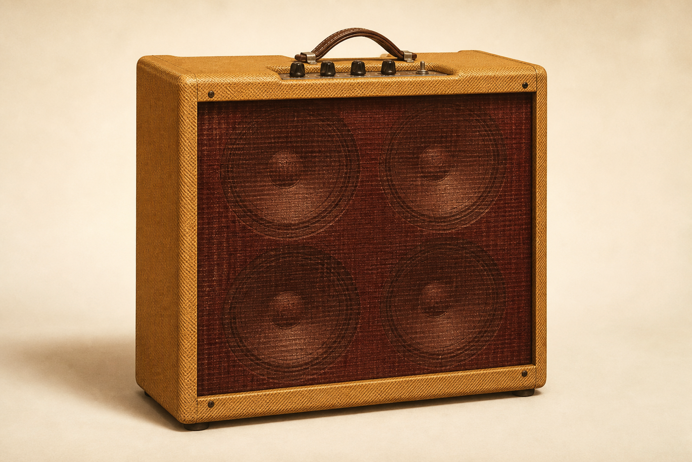
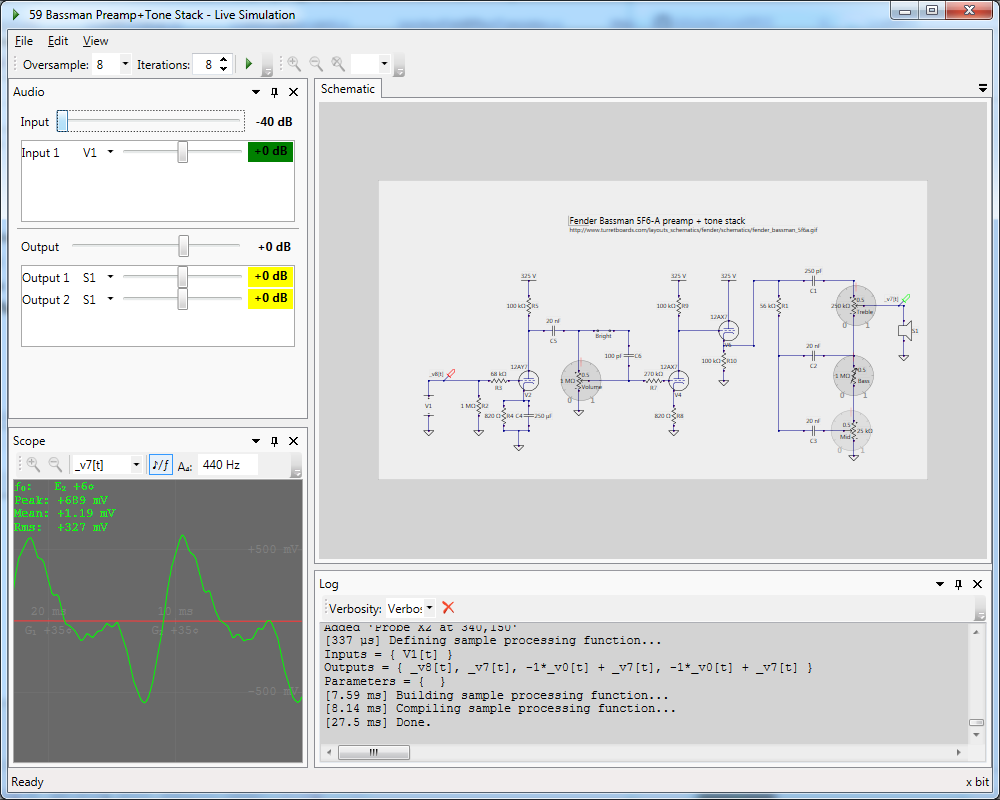

# Bassman 5F6-A Circuit Model

JUCE VST3/Standalone plugin for a circuit-based 5F6-A-style guitar preamp model.

这是一个用电路方程模拟 5F6-A 风格前级的 JUCE 插件。

<p align="center">
  
</p>

## LiveSPICE 参考电路

<p align="center">
  
</p>

<p align="center"><sub>来源：<a href="https://www.livespice.org/">LiveSPICE 官方 Bassman 5F6-A preamp 示例</a>。该图用于对照电路范围，不是本项目界面截图。</sub></p>

## 方法适用性

5F6-A 是当前实现案例，不是方法的适用边界。核心流程是：根据电路拓扑生成关联矩阵，将线性网络离散为 DK 状态空间，再逐采样求解非线性器件端口。

| 可复用方法 | 5F6-A 案例配置 |
| --- | --- |
| DK 矩阵构建、Newton/列主元 QR 回退、稳态初始化、过采样 | 节点连接、元件值、12AX7 参数和 Tone Stack |

替换拓扑、元件参数和非线性器件模型后，同一方法可用于其他电子管音箱前级、失真电路和模拟效果器。

## 实现范围

```text
Input → 第一前级近似 → Volume/Bright
      → 两只 12AX7 + Treble/Bass/Middle Nodal DK 网络
      → 4× oversampling → Mix/Output
```

包含 VST3、Standalone、双声道处理、参数保存和核心 DSP 测试。

不包含功率放大级、输出变压器、扬声器、箱体和麦克风模型。

## 工程结构

```text
JUCE/
├── Bassman5F6ACircuitModel.jucer  # 用 Projucer 直接打开
└── Source/                        # 插件入口与电路 DSP
Tests/
├── Automated/CircuitTests.cpp     # 自动数值测试
├── Plugin/ProcessorTests.cpp      # 离线块与资源生命周期测试
└── README.md                      # 测试内容与运行方式
docs/                              # 方法、公式、研究过程与参考资料
```

## 构建

### Projucer

打开 [`JUCE/Bassman5F6ACircuitModel.jucer`](JUCE/Bassman5F6ACircuitModel.jucer)，在 Projucer 中执行 **Save Project and Open in IDE**，然后编译 VST3 或 Standalone target。

在 Visual Studio 中请选择 **Release | x64** 后再生成并安装插件。Debug 版本只使用 1× 采样供调试；Release 版本使用 4× 过采样。不要把 Debug 版本作为 DAW 中的日常插件。

若 JUCE 不在仓库同级的 `JUCE/` 目录，通过 Projucer 的模块设置选择本机 `JUCE/modules`。

### CMake

要求 CMake 3.22+、C++17 和 JUCE 8。

```powershell
git clone https://github.com/chaodede/Bassman-5F6A-Circuit-Model.git
cd Bassman-5F6A-Circuit-Model
cmake -S . -B build -DJUCE_SOURCE_DIR="D:/path/to/JUCE"
cmake --build build --config Release --parallel
ctest --test-dir build -C Release --output-on-failure
```

未指定 `JUCE_SOURCE_DIR` 时，CMake 会获取 JUCE 8.0.8。

只构建和测试电路核心：

```powershell
cmake -S . -B build/core -DBASSMAN_BUILD_PLUGIN=OFF
cmake --build build/core --config Release --parallel
ctest --test-dir build/core -C Release --output-on-failure
```

## 代码入口

- `JUCE/Bassman5F6ACircuitModel.jucer`：Projucer 工程
- `JUCE/Source/DSP/AmpCircuit.*`：完整信号链
- `JUCE/Source/DSP/NodalDKModel.*`：电路矩阵和 Newton 求解
- `JUCE/Source/DSP/TriodeModel.*`：12AX7 模型
- `JUCE/Source/PluginProcessor.*`：JUCE、参数和过采样
- `Tests/Automated/CircuitTests.cpp`：自动数值测试

DK Method、三极管方程和非线性求解见[核心算法](docs/research-process.md)，资料来源见[参考资料](docs/references.md)。

代码使用 [AGPL-3.0-or-later](LICENSE)。本项目与 Fender 及所引用的软件项目无关联。
