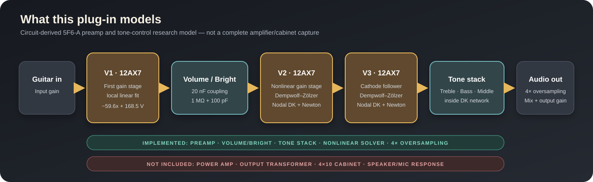

# 电路与模型说明

这篇文档回答三个最先应该明确的问题：研究对象是什么、插件究竟模拟到哪里、代码中的电路图怎样对应真实元件。

## 硬件目标

5F6-A 是 1950 年代末的电子管组合音箱架构，常与 lacquered tweed 外观和 4×10 扬声器配置联系在一起。它的前级和音调网络后来影响了许多吉他放大器设计。本项目研究的是其**前级电压放大与被动音调网络**，不是整台组合音箱的端到端复刻。

> 图片是本项目生成的无商标概念图，只帮助读者建立硬件形态印象，不是历史照片或官方产品图。

## 模型覆盖范围

输入到输出依次为：

1. 第一只 12AX7 前级的局部线性拟合；
2. 20 nF 耦合电容、1 MΩ Volume 和 100 pF Bright 支路；
3. 一只非线性 12AX7 电压放大级；
4. 一只非线性 12AX7 cathode follower；
5. Treble/Bass/Middle 被动音调网络；
6. 4× 上采样域中的 Dry/Wet 混合和抗混叠降采样。

第三至第五项被放在同一个 Nodal DK 网络中，保留电子管和 Tone Stack 之间的负载耦合。第一前级与 Volume/Bright 被拆出，是计算量、可解释性与电路完整度之间的研究折衷。

## 代码中实际实现的 DK 网络

下图不是从网络图片复制的服务手册原理图，而是根据 `NodalDKModel.cpp` 的节点与元件连接重新绘制，因此可以逐项和代码核对。

### 端口和状态

| 项目 | 数量 | 说明 |
| --- | ---: | --- |
| 电路节点 | 12 | 地为 node 0，不计入 12 个未知节点 |
| 输入电压源 | 2 | 音频输入 U1；325 V B+ 电源 U2 |
| 输出端口 | 1 | node 9 对地 |
| 电容状态 | 3 | 250 pF、20 nF、20 nF |
| 非线性端口 | 4 | 每只三极管的 grid–cathode 与 plate–cathode 端口 |

### 电阻

| 连接 | 数值/控制 |
| --- | --- |
| n1–n2 | 270 kΩ |
| n3–ground | 820 Ω |
| n5–n4 | 100 kΩ |
| n6–ground | 100 kΩ |
| n6–n7 | 56 kΩ |
| n8–n9 | `(1 − Treble) × 250 kΩ` |
| n9–n10 | `Treble × 250 kΩ` |
| n10–n11 | `Bass × 500 kΩ` |
| n11–n12 | `(1 − Middle) × 25 kΩ` |
| n12–ground | `Middle × 25 kΩ` |

### 电容

| 连接 | 数值 | 作用 |
| --- | ---: | --- |
| n6–n8 | 250 pF | Treble 高频支路 |
| n7–n10 | 20 nF | Tone Stack 支路 |
| n7–n12 | 20 nF | Tone Stack 支路 |

Bass 控制在历史代码中采用线性归一化电阻映射，而实机常见对数规律，因此插件旋钮位置不应被理解为面板刻度的一一对应。所有电位器限制在 0.01–0.99，避免理想 0 Ω 支路使节点矩阵奇异。

## Volume / Bright 网络

DK 网络之前还有一个单独的 RC 块：

| 元件 | 数值/定义 |
| --- | --- |
| 音量电位器 | 1 MΩ，分成 `(1 − Volume)R` 和 `Volume·R` |
| 耦合电容 | 20 nF |
| Bright 电容 | 100 pF |
| 后级等效负载 | 950 kΩ |

关闭 Bright 时为一阶网络；打开 Bright 后为二阶网络。两条传递函数都用双线性变换离散化，代码位于 `VolumeBrightFilter.cpp`。

## 三极管模型

两只 DK 三极管使用 Dempwolf–Zölzer 12AX7 连续可微模型。每只管返回两个端口电流和 2×2 解析雅可比。连续可微不是为了让曲线更“漂亮”，而是为了让逐采样 Newton 法有一致的局部导数。

第一前级目前只保留研究阶段在目标工作区得到的拟合：

$$
v_{p1} = -59.6v_{in} + 168.5.
$$

其中 168.5 V 是板极静态工作点，后面的 20 nF 耦合电容会隔离直流。这个近似不会重现第一只管在大信号下的截止、栅流和压缩，是当前模型最明确的物理限制。

## 从这里继续读

- 想看矩阵怎样从电路生成：阅读[完整研究过程](research-process.md#4-nodal-dk-方程如何得到)。
- 想看 Newton、稳态和过采样实现：阅读[实现说明](implementation.md)。
- 想追溯三极管、Tone Stack 与 DK 方法来源：阅读[参考文献](references.md)。
- 想了解旧版本为何重写：阅读[开发历史与旧实现审计](legacy-audit.md)。
