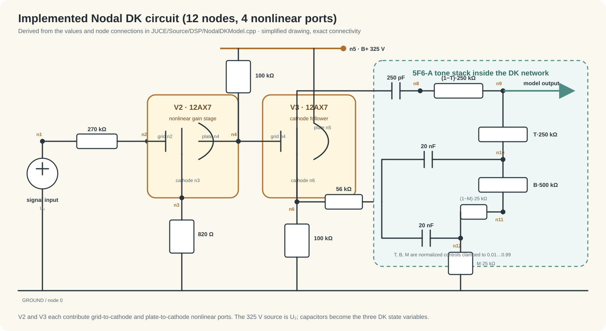

# 研究脉络

## 1. 研究目标

目标是把 5F6-A 风格前级变成可实时运行的音频插件，同时保留电路参数与声音变化之间的关系。

研究范围到前级和音调网络为止，不包括功放、输出变压器和 4×10 扬声器系统。项目也尝试过用卷积、GRU 等网络代替昂贵的非线性求解，但效果和泛化不理想，所以最终版本仍采用电路计算。

## 2. 两个关键参考工具

### LiveSPICE：实时仿真的方向

[LiveSPICE](https://www.livespice.org/) 是本研究最重要的实践参考。它不是普通离线 SPICE，而是让声卡输入实时通过电路，并提供 VST 工作流。官网示例直接包含 Bassman 5F6-A 前级。

它说明了实时电路仿真的几个关键取舍：

- 在运行前用计算机代数系统分析和化简电路；
- 为具体电路生成专用计算程序，把通用逻辑移出实时路径；
- 使用比传统 SPICE 更简单的器件模型换取速度；
- 接受“可实时运行的电路近似”与“最高精度离线仿真”并不是同一个目标。

本项目没有复制 LiveSPICE 源码，但采用了相同的基本判断：能预计算的矩阵不在音频循环里重算，实时阶段只更新状态和求小型非线性系统。

### Online Circuit Solver：线性公式的工具

[Online Circuit Solver](https://onlinecircuitsolver.com/) 用 Modified Nodal Analysis 建立线性电路方程，并输出拉普拉斯传递函数。它在研究后期主要用于处理和检查公式，而不是作为最终插件运行时的一部分。

适合交给它的内容包括：

- RC 耦合和高通关系；
- Volume/Bright 电位器与旁路电容；
- 线性音调网络的传递关系；
- 不同元件值下的幅频和相频变化。

电子管属于非线性器件，不能只靠一个线性传递函数完成，因此后续仍需要三极管模型和逐采样迭代。

## 3. 从电路到插件

### 第一步：确定范围

原始研究先分析完整 5F6-A 电路，后来为了实时性把它拆成三个块：

1. 第一前级；
2. Volume/Bright 线性网络；
3. 两只 12AX7 与 Treble/Bass/Middle 网络。

第一前级目前使用目标工作区的一次近似。它减少了计算量，但也意味着强过驱时不可能完全复现实管的截止和压缩。

### 第二步：解决线性块

用 Online Circuit Solver 一类的 MNA/Laplace 工具检查线性公式，再把连续域传递关系离散成 IIR。采样率、Volume 或 Bright 状态变化时更新系数，不需要逐采样解整个电路。

### 第三步：建立非线性网络

后两只 12AX7 和音调网络保留为 Nodal DK 系统。当前代码中的拓扑如下，图只在这里保留一次：



每个采样点的处理可以概括为：

```text
电容历史 + 当前输入
        ↓
计算三极管端口电压
        ↓
Newton 迭代求端口电流
        ↓
更新电容状态并输出
```

三极管使用连续可微的 12AX7 电流模型，使 Newton 求解器能够得到解析雅可比。当前实现解固定的 4×4 线性系统，并加入阻尼、有限值检查和失败统计。

### 第四步：处理混叠和实时工程

非线性会产生超过 Nyquist 频率的谐波，因此插件在 4 倍采样率下运行电路，再降采样到宿主速率。JUCE 层还负责双声道独立状态、参数自动化、状态保存和真正的 Dry/Wet 混合。

## 4. 当前实现与参考工具的区别

- Online Circuit Solver 是线性公式计算工具；本仓库把计算结果落实为固定的实时 DSP 结构。
- LiveSPICE 是通用的实时电路编辑和仿真系统；本仓库只实现一个固定的 Bassman 风格前级，因此代码更小，但适用范围也更窄。
- 本插件不是 LiveSPICE 的移植版，也没有能力加载任意原理图。
- 当前三极管、过采样和电路拆分都有近似，不能把结果称为实机精确复刻。

## 5. 已验证和仍需验证的内容

自动测试覆盖三极管雅可比、Volume/Bright 冲激响应、极端 Tone 设置下的有限输出和 Newton 收敛情况。

下一步真正有价值的验证只有三类：

1. 用相同电路和输入与 LiveSPICE 比较波形、扫频和谐波；
2. 用已校准的实机前级测试点比较瞬态和旋钮轨迹；
3. 比较 1×、2×、4×、8× 过采样的频谱和 CPU 成本。

在这些对照完成前，本项目应被称为“基于 5F6-A 拓扑的研究插件”。
